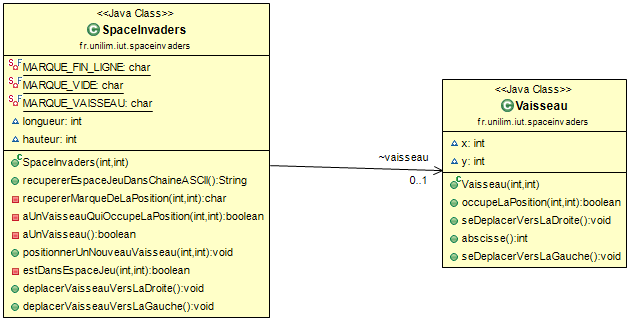
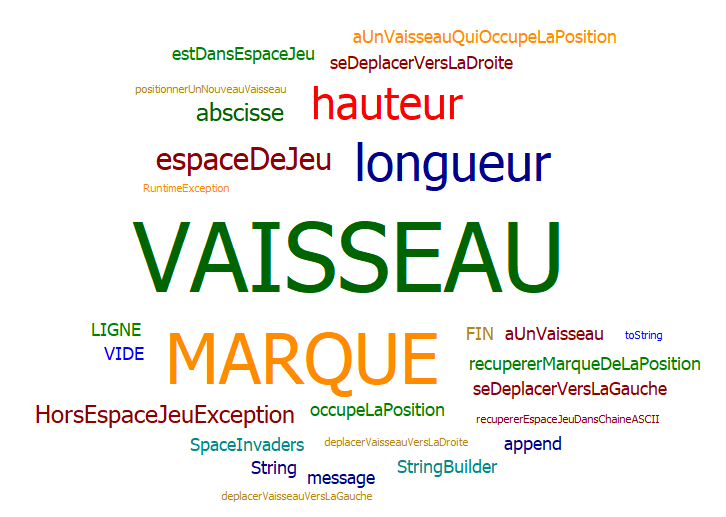
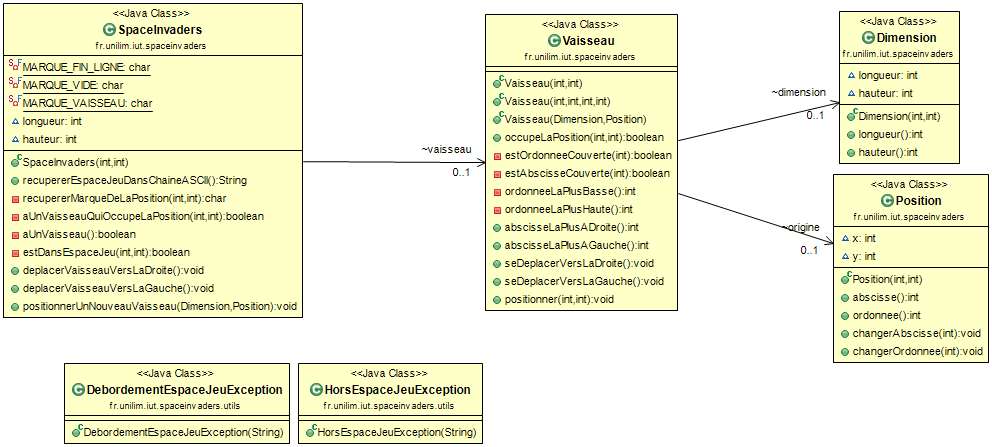
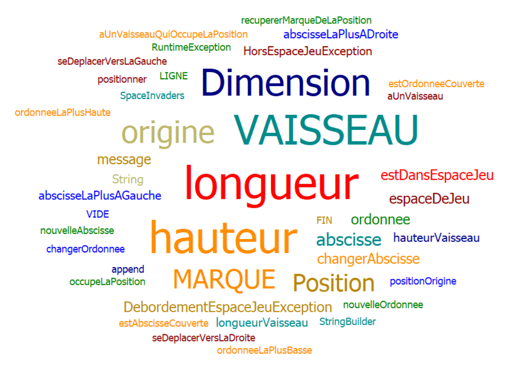
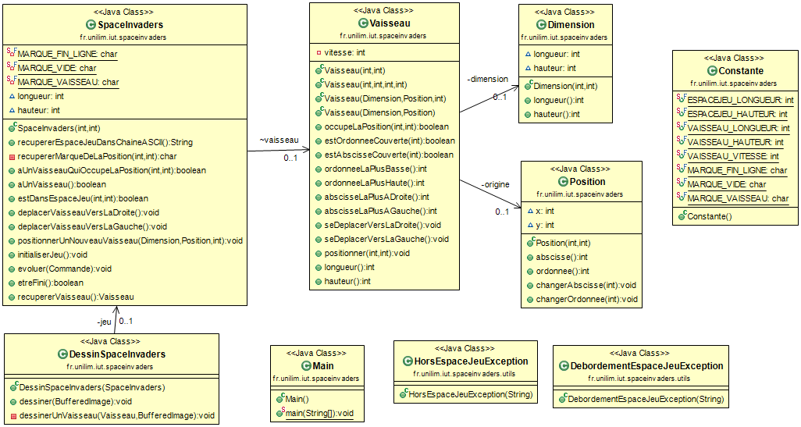
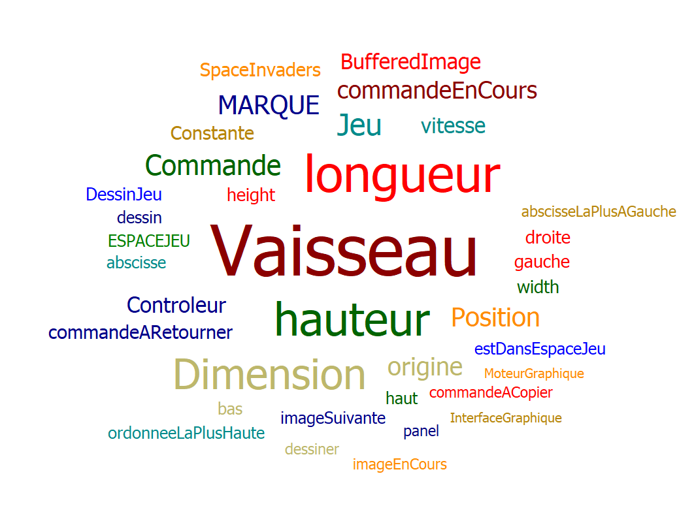
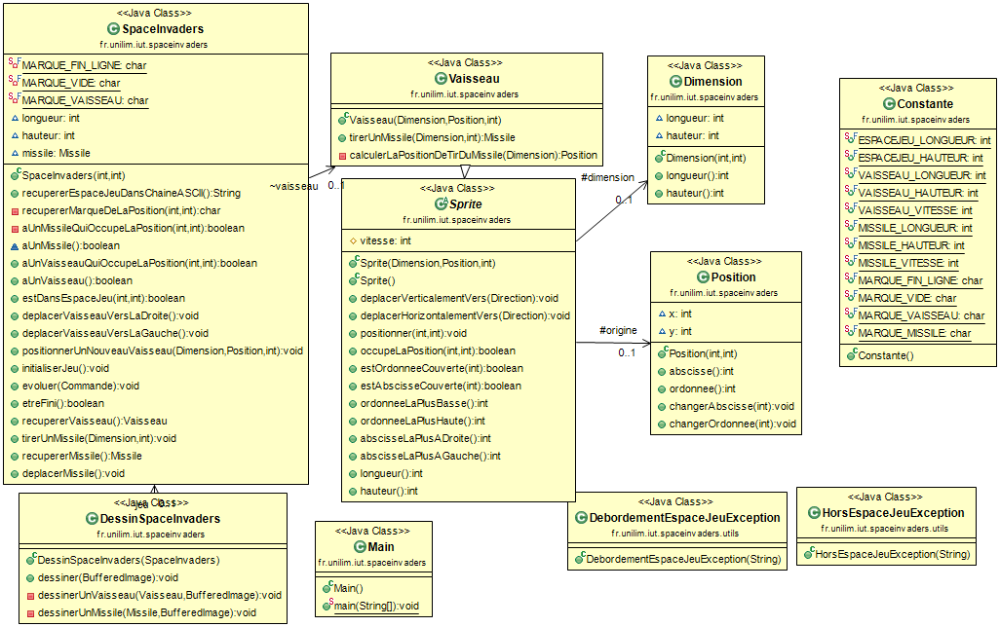
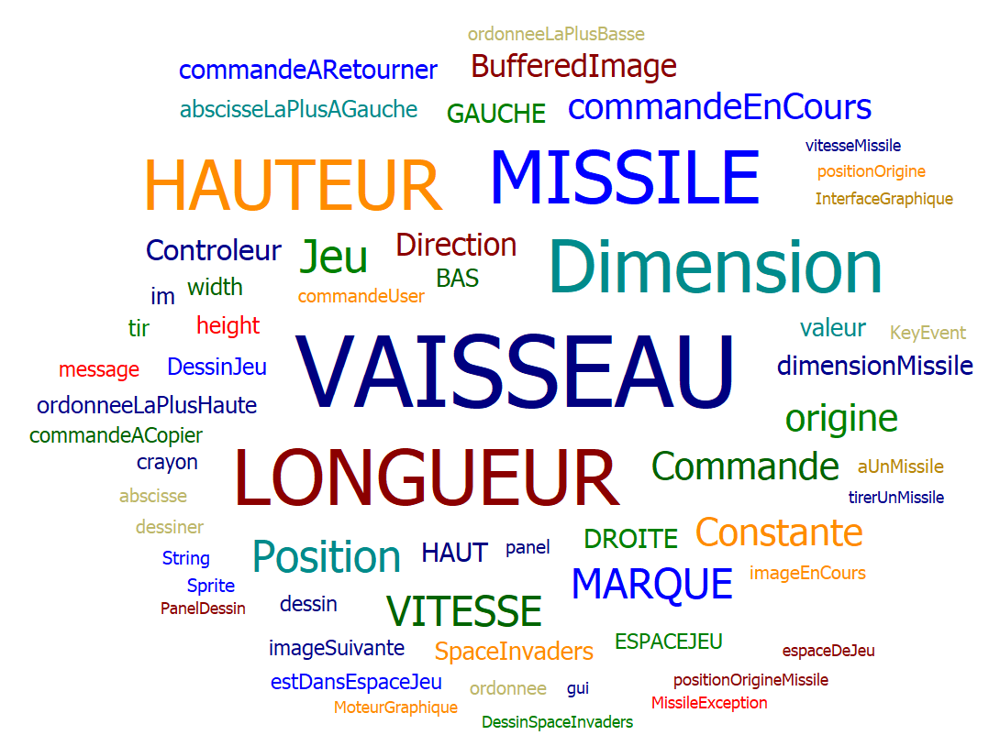
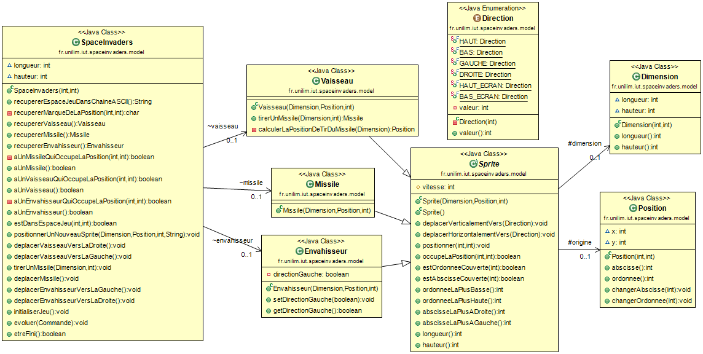
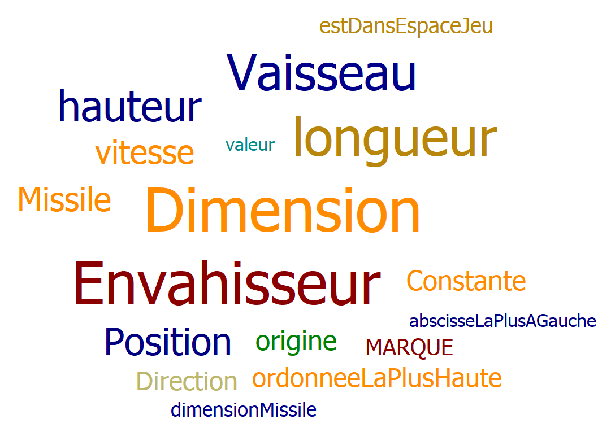

# spaceinvaders

- [Semaine n°1 : du 30 mars au 5 avril](#semaine1)  
- [Semaine n°2 : du 6 au 12 avril](#semaine2)  
- [Semaine n°3 : du 13 au 19 avril](#semaine3)  
- [Semaine n°4 : du 27 avril au 3 mai](#semaine4)  
- [Semaine n°5 : du 4 au 10 mai](#semaine5) 
- [Glossaire](#glossaire)

-------------

## Semaine n°1 : du 30 mars au 5 avril 

### Sprints et fonctionnalités réalisées 

#### Fonctionnalité n°1 : Déplacer un vaisseau dans l'espace de jeu (fini)

- Story n°1 : Créer un espace de jeu  
Un espace de jeu est créé aux dimensions données (2D) 
Cet espace de jeu est vide

-  Story n°2 : Positionner un nouveau vaisseau dans l’espace de jeu  
Un nouveau vaisseau est créé
Le vaisseau est positionné aux coordonnées transmises
Si un nouveau vaisseau essaye d’être positionné en dehors des limites de l’espace jeu, alors une exception devra être levée.
 Contraintes :
La position souhaitée est transmise par ses coordonnées x et y.
Le coin supérieur gauche de l’espace jeu (point en haut à gauche) a pour coordonnées (0,0)
La taille du vaisseau est réduite pour l'instant à son minimum (1 seul point)    

- Story n°3 : Déplacer le vaisseau vers la droite dans l'espace de jeu  
Le vaisseau se déplace d'un pas vers la droite 
Si le vaisseau se trouve sur la bordure droite de l'espace de jeu, le vaisseau doit rester immobile (aucun déplacement, aucune exception levée : le vaisseau reste juste à sa position actuelle).

- Story n°4 : Déplacer le vaisseau vers la gauche dans l'espace de jeu  
Le vaisseau se déplace d'un pas vers la gauche 
Si le vaisseau se trouve sur la bordure gauche de l'espace de jeu, le vaisseau doit rester immobile (aucun déplacement, aucune exception levée : le vaisseau reste juste à sa position actuelle).

### Fonctionnalité en cours d’implémentation : 
Aucune

### Diagramme de classes 

### Nuage de mots du projet spaceinvaders (séance n°1)  
 

### Difficultés rencontrées 
Aucune

### Remarques diverses
 Pour pouvoir, mettre en place les tests, il a été nécessaire d’ajouter une fonctionnalité supplémentaire qui permet de représenter l’espace de jeu dans une chaîne ASCII.

-------------

## Semaine n°2 : du 6 au 12 avril 

### Sprints et fonctionnalités réalisées 

#### Fonctionnalité n°2 : Dimensionner le vaisseau (fini)

- Story n°1 : Pouvor dimmensionner le vaisseau  
Un vaisseau possédant une longueur et une hauteur données est créé.
 
- Story n°2 : Faire en sorte qu'il soit impossible de positionner un nouveau vaisseau qui déborde de l'espace de jeu  
Un vaisseau précédemment créé est positionner dans l'espace de jeu aux coordonnées données.
Si le vaisseau dépasse de l'espace de jeu  alors une exception est levée. 
Contraintes : La position souhaitée est transmise par ses coordonnées x et y via une classe Dimension.
Le coin supérieur gauche de l’espace jeu (point en haut à gauche) a pour coordonnées (0,0)
  
- Story n°3 : Déplacer un vaisseau vers la droite en tenant compte de sa dimension  
Le vaisseau se déplace d'un pas vers la droite 
Si ce déplacement impliquerait que le vaisseau dépasse de l'espace de jeu, le vaisseau doit rester immobile (aucun déplacement, aucune exception levée : le vaisseau reste juste à sa position actuelle).

- Story n°4 : Déplacer un vaisseau vers la gauche en tenant compte de sa dimension  
Le vaisseau se déplace d'un pas vers la gauche 
Si ce déplacement impliquerait que le vaisseau dépasse de l'espace de jeu, le vaisseau doit rester immobile (aucun déplacement, aucune exception levée : le vaisseau reste juste à sa position actuelle).

### Fonctionnalité en cours d'implémentation 

Aucune

### Diagramme de classes 

### Nuage de mots 

### Difficultés rencontrées 
Aucune

### Remarques diverses

Aucune

-------------

## Semaine n°3 : du 13 au 19 avril 

### Sprints et fonctionnalités réalisées 

#### Spike : Prise en main et intégration d'un moteur graphique

- Importation du moteur graphique.    
- Tests du moteur graphique sur un projet dédié.  
- Adaptation du moteur graphique au projet Space Invaders.  

#### Fonctionnalité n°3 :Choisir la vitesse du vaisseau (fini)

- Story n°1 : Ajouter une vitesse au vaisseau de manière non-regressive  
Désormais, un vaisseau aura une vitesse qui caractérise la distance qu'il parcourt sur un temps donné. On ajoute cet attribut en maintenant le bon déroulement des tests précédents.
 
- Story n°2 : Régler la vitesse du vaisseau  
La vitesse d'un vaisseau est paramétrable lors de la création de celui-ci : à travers son constructeur. Pour le moment il n'est pas possible de modifier la vitesse du vaisseau après sa création.

- Story n°3 : Faire en sorte que le déplacement se fasse correctement pour une vitesse quelconque
Le vaisseau se déplace, soit vers la gauche, soit vers la droite. Il parcourt à chaque déplacement une distance égale à sa vitesse

- Story n°4 : Adapter le moteur graphique à la notion de vitesse 
Le vaisseau se déplace dans l'application graphique à une vitesse préalablement déterminée. Avec quelques essais sur l'application graphique on détermine une vitesse "idéale" pour un jeu Space Invaders.

### Fonctionnalité en cours d'implémentation 

Aucune

### Diagramme de classes 

### Nuage de mots 

### Difficultés rencontrées 
Aucune

### Remarques diverses

Aucune

-------------

## Semaine n°4 : du 27 avril au 3 mai 

### Sprints et fonctionnalités réalisées 

#### Fonctionnalité n°4 : tirer un missile depuis le vaisseau (fini)

- Story n°1 : Définir ce qu'est un missile : création de la superclasse "Sprite" pour gérer le comportement du missile et du vaisseau
 
- Story n°2 : Tirer un missile  
Lorsqu'on tire un missile, on crée et on positionne un nouveau missile devant le vaisseau, au centre de celui-ci. On s'assure que les dimensions du missile sont cohérente avec celles du vaisseau : pas plus grandes que lui.

- Story n°3 : Faire déplacer le missile à la verticale de manière autonome  
Une fois tiré le missile doit se déplacer automatiquement vers le haut de l'écran à une vitesse donnée

- Story n°4 : Le Missile doit disparaître du jeu lors qu'il atteint le haut de l'espace jeu  
Une fois que le missile est au moins partiellement sorti de l'écran, il doit disparaitre afin de permettre d'en tirer un nouveau

#### Spike : Prise en main et intégration d'un moteur graphique

- Adaptation du moteur graphique à la nouvelle fonctionnalité

### Fonctionnalité en cours d'implémentation 

Aucune

### Diagramme de classes 

### Nuage de mots 

### Difficultés rencontrées 
Aucune

### Remarques diverses

Aucune

-------------

## Semaine n°5 : du 4 au 10 mai 

### Sprints et fonctionnalités réalisées 

#### Fonctionnalité n°5 : Ajouter un envahisseur dans le jeu (fini)

- Story n°1 : Positionner un envahisseur  
Un nouvel envahisseur est créé
L'envahisseur est positionné aux coordonnées transmises. Contraintes :
La position souhaitée est transmise par ses coordonnées x et y.  
Les dimensions souhaitées sont transmises par sa longueur et sa hauteur. 
Des Exceptions sont levées si l'envahisseur est placé hors de l'espace de jeu ou si il dépasse de celui ci de par ses dimensions.
 
- Story 2 : Déplacer un envahisseur vers la gauche de façon autonome sans sortir de l'espace de jeu  
L'envahisseur doit être capable de se déplacer automatiquement vers la gauche à une vitesse donnée sans sortir de l'espace de jeu

- Story 3 : Déplacer un envahisseur vers la droite de façon autonome sans sortir de l'espace de jeu  
L'envahisseur doit être capable de se déplacer automatiquement vers la droite à une vitesse donnée sans sortir de l'espace de jeu

- Story 4 : Changer de direction   
Si l'envahisseur atteint le bord de l'espace de jeu, il doit changer de direction

#### Spike : Prise en main et intégration d'un moteur graphique

- Adaptation du moteur graphique à la nouvelle fonctionnalité

### Fonctionnalité en cours d'implémentation 

Aucune

### Diagramme de classes 

### Nuage de mots 

### Difficultés rencontrées 
Aucune

### Remarques diverses

Pour le moment : pas d'interaction entre les différents Sprites.
Modifications pour généraliser le comportement des sprites : le positionnement d'un vaisseau ou d'un envahisseur se fait de la même façon.

-------------  

## Glossaire 

* **Vaisseau** :  véhicule commandé par le joueur, pouvant se déplacer de droite à gauche et ayant la possibilité de lancer des missiles destinés à détruire le(s) envahisseurs. Il possède une **Position** et une **Dimension**.

* **Envahisseur**  :  ennemi qui apparaît à l'écran, se déplace automatiquement et qui doit être détruit par un missile lancé depuis le vaisseau du joueur.

* **Missile** :  projectile envoyé à la verticale par le vaisseau vers l'envahisseur dans le but de le détruire.

* **Dimension** : caractéristique du vaisseau qui défini sa taille en 2D grâce à une longueur et une hauteur.

* **Position** : caractéristique du vaisseau qui défini sa position en 2D grâce à une abscisse et une ordonnée.

* **Sprite** : un élément graphique qui peut se déplacer sur l'écran. Par exemple : un vaisseau ou un missile sont des sprites.

------------- 
